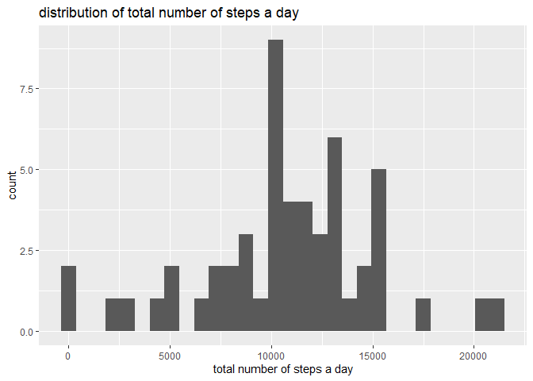
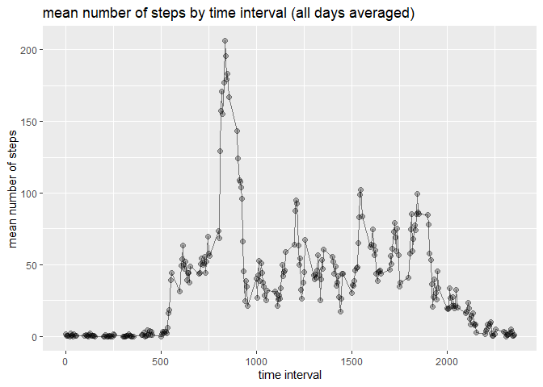
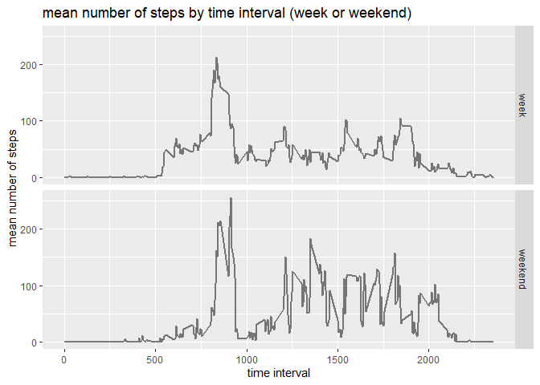

## Loading and preprocessing the data

I unzip the data and load it into R

```r
library(data.table)
unzip("activity.zip")
data <- setDT(read.csv("activity.csv")) # loading as a data.table object
data$date <- as.Date(data$date) # converting dates in date format
data$steps <- as.numeric(data$steps) # reformatting steps to numeric
str(data) # overview
```

```
## Classes 'data.table' and 'data.frame':	17568 obs. of  3 variables:
##  $ steps   : num  NA NA NA NA NA NA NA NA NA NA ...
##  $ date    : Date, format: "2012-10-01" "2012-10-01" ...
##  $ interval: int  0 5 10 15 20 25 30 35 40 45 ...
##  - attr(*, ".internal.selfref")=<externalptr>
```


## What is mean total number of steps taken per day?

I will create the adequate new variable, as the mean number of steps per day


```r
data[, steps_sum_day := sum(na.omit(steps)), by = date] # create new variable steps_total_day and assign to it the sum of steps, omitting NA values, per date
data[steps_sum_day == 0, steps_sum_day := NA] # but if the sum = 0, it is because data is actually missing

data_sum <- copy(data[, .SD[1], by = date]) # subsetting only first row by day
```

Here is the histogram representing the total steps per day


```r
library(ggplot2)
ggplot(data = data_sum)+
    geom_histogram(aes(steps_sum_day))+
    labs( title = "distribution of total number of steps a day",
          x = "total number of steps a day")
```

```
## `stat_bin()` using `bins = 30`. Pick better value with `binwidth`.
```

```
## Warning: Removed 8 rows containing non-finite values (stat_bin).
```

<!-- -->

The average number of steps per day is : 


```r
mean(na.omit(data_sum$steps_sum_day))
```

```
## [1] 10766.19
```

And the median number of steps per day is : 


```r
median(na.omit(data_sum$steps_sum_day))
```

```
## [1] 10765
```


## What is the average daily activity pattern?

I create the new average variable, as the mean of steps per interval


```r
data[, steps_interval_mean := mean(na.omit(steps)), by = interval]
data_interval <- copy(data[, .SD[1], by = interval]) # subsetting to keep only the first row by interval
```

I will plot the mean number of steps by interval (all data)


```r
ggplot(data = data_interval, aes(x = interval, y = steps_interval_mean))+
    geom_point(alpha = 0.3, size = 2)+
    geom_line(alpha = 0.5, size = 0.5)+
    labs( title = "mean number of steps by time interval (all days averaged)",
          y = "mean number of steps",
          x = "time interval")
```

<!-- -->

The time 5-min interval with highest average number of steps is : 


```r
index_max <- which.max(data_interval$steps_interval_mean)
data_interval[index_max]$interval
```

```
## [1] 835
```


## Imputing missing values

In our data , the total number of rows with missing steps value is : 


```r
nrow(data[is.na(steps)])
```

```
## [1] 2304
```

I will replace NA value by the mean of the respective interval. I work in a new data set (copy)


```r
data_imp <- copy(data)
data_imp[is.na(steps), steps := steps_interval_mean]
data_imp <- copy(data_imp[, .(steps, interval, date)]) # and I only keep the original variables
```

I now re-create the average variable, as the mean of steps per interval, and the sum variable by date


```r
data_imp[, steps_interval_mean := mean(na.omit(steps)), by = interval]
data_imp_interval <- copy(data_imp[, .SD[1], by = interval]) # subsetting to keep only the first row by interval

data_imp[, steps_sum_day := sum(na.omit(steps)), by = date]
data_imp_sum <- copy(data_imp[, .SD[1], by = date]) # subsetting to keep only the first row by interval
```

In my imputed data, the histogram of steps by interval looks like this : 


```r
ggplot(data = data_imp_interval, aes(x = interval, y = steps_interval_mean))+
    geom_point(alpha = 0.3, size = 2)+
    geom_line(alpha = 0.5, size = 0.5)+
    labs( title = "mean number of steps by time interval (all days averaged)",
          y = "mean number of steps",
          x = "time interval")
```

<!-- -->

The average number of steps per day is : 


```r
mean(data_imp_sum$steps_sum_day)
```

```
## [1] 10766.19
```

And the median number of steps per day is : 


```r
median(data_imp_sum$steps_sum_day)
```

```
## [1] 10766.19
```

Our imputation has increased the mean and median. It also made them identical. 


## Are there differences in activity patterns between weekdays and weekends?

I create a variable indicating if day is week or weekend


```r
data_imp[, day := weekdays(date)] # indicates the days of the week
data_imp[, weekend := "week"] # creating a variable weekend, set to "week"
data_imp[day %in% c("samedi", "dimance"), weekend := "weekend"] # if day is saturday or sunday, its weekend

data_imp[, steps_interval_mean := mean(na.omit(steps)), by = c("weekend", "interval")] # compute means by interval and grouped by weekend variable
data_imp_interval_we <- copy(data_imp[, .SD[1], by = c("weekend", "interval")]) # subetting to keep only first row by interval and weekend variable
```

I now plot the average number of steps, per interval, grouped by my "weekend" variable. 


```r
ggplot(data = data_imp_interval_we, aes(x = interval, y = steps_interval_mean))+
    geom_line(alpha = 0.5, size = 1)+
    
    labs( title = "mean number of steps by time interval (week or weekend)",
          y = "mean number of steps",
          x = "time interval")+
    
    facet_grid(facets = "weekend")
```

<!-- -->

